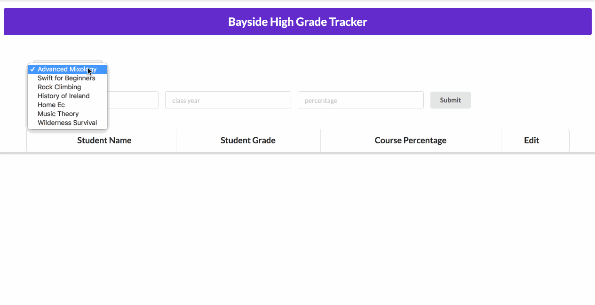

# Bayside High Attendance Tracker

## Demo

Use this gif as an example of how the app should work.



## Instructions

For this project, you’ll be building out a React application that displays a list of student attendance per course.

Part of what this code challenge is testing is your ability to follow given instructions. While you will have some freedom in how you implement the features, be sure to carefully read the directions and follow the steps in order to build the application. **It would be better to deliver 3 working and 2 not-working deliverables rather 5 half-working deliverables.**

## Setup

1. Fork and clone this repository.

2. Run `npm start`: This will open both your React page on port `6000` and your backend on port `6001`.

3. The app uses [Semantic UI](https://semantic-ui.com/) for styling. If you see any unfamiliar classNames on some components, don't sweat! That's coming from Semantic UI and you shouldn't need to touch it.

## Endpoints

The base URL for your backend is: `http://localhost:6001`

The endpoints you need to hit are:

- GET: `/courses`

Returns an array of all courses.

```
GET: http://localhost:6001/courses

Example Response:
[
  {
    "id": 269,
    "name": "Rock Climbing",
    "instructor": "Avi Flombaum",
    "semester": "Spring 2017",
  },
  ...
]
```

- GET: `/students`

Returns an array of all courses.

```
GET: http://localhost:6001/students

Example Response:
[
    {
      "id": 5945,
      "name": "Mr. Princess Predovic",
      "class_year": 11,
      "percentage": 93,
      "course": "Having a good time",
      "attending": true
    },
    ...
]
```

- PATCH: `/students/:id`

Modify a student.

```
PATCH: http://localhost:3001/students/5945

Required headers:
{
  "Content-Type": "application/json"
}

Required body:
// any of the following fields you'd like to change
{
  "id": 5945,
  "name": "Mr. Princess Predovic",
  "class_year": 11,
  "percentage": 93,
  "course": "Having a good time",
  "attending": true
}

Example Response:

{
  "id": 5945,
  "name": "Mr. Princess Predovic",
  "class_year": 11,
  "percentage": 93,
  "course": "Having a good time",
  "attending": true
}
```

## Core Deliverables

Below are the deliverables you should create.

1. When the app starts, I can see and select a list of courses.

2. When I select a course, I can see all students currently enlisted to it.

3. I can toggle whether a student is attending or not, and I can see the changes on the screen immediately.

4. When I refresh my app, I can still see any changes I made previously.

## Advanced Deliverables

These deliverables are not required to pass the code challenge, but if you have the extra time, or even after the code challenge, they are a great way to stretch your skills.

> Note: If you are going to attempt these advanced deliverables, please be be sure to have a working commit with all the Core Deliverables first!

1. I can sort students by name or attending status.

2. I can change which course a student is enlisted to.

## Rubric

### Props & State

1. No code or very little code has been written or the code doesn't run. If it runs, no deliverables have been met. Not managed to set state or pass props successfully.

2. State is not being set or updated. Props are not being passed down, or you are passing down the right prop but trying to access it incorrectly (wrong name, unnecessary `this`, `state` instead of `props`) or key props are missing. API call does not successfully populate state.

3. State is working. However, it may be in the wrong component, it might be nested oddly or might have some unnecessary state. Props are being passed unnecessarily to components. Functions that change or calculate state are not defined in the component that they are most closely tied to.

4. State works and is held by the lowest common component. No unnecessary state is created. Only the necessary props are being passed down. Functions used to edit state are passed down.

5. Advanced deliverables are met.

### Code Structure/Efficiency

1. No code or very little code has been written or the code doesn't run, i.e. syntax errors, imports missing, etc. If it runs, no deliverables have been met.

2. Starter components have been unnecessarily modified and broken. There is no reference to componentDidMount. Incorrect or unnecessary lifecycle methods are used.

3. Fetch is triggered in the right place. Code is not abstracted into clear methods. Additional components have been added which serve no purpose. Props and variables could be named consistently and descriptively.

4. Components are structured in a logical way. Class components only used when needed, functional components used for everything else. Code is abstracted into clear methods. Used object destructuring and spread operator successfully.

5. Advanced deliverables met. Uses some of the following: destructuring, functional components, spreading, hooks, pure functions, performance is taken into account.

### Rendering

1. No code or very little code has been written or the code doesn't run. If it runs, no deliverables have been met.

2. Did not manage to render everything that was asked for in the deliverables.

3. Renders everything that is asked for in the deliverables. Components could be more abstract/reusable. May have created own components instead of using the components provided.

4. Renders everything that is asked for in the deliverables. Components are abstract/reusable. No unnecessary components were created.

5. Everything from 4 plus extra features were added that are not listed in the deliverables.
